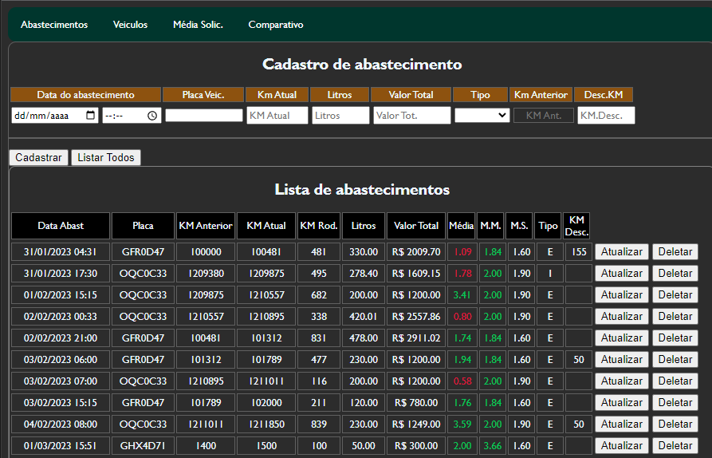
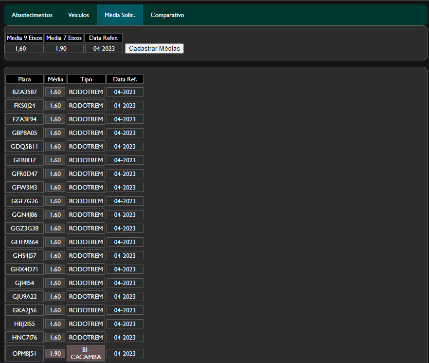

# Gestão de Frota
Gestão de Frota
Esse é um dos maiores projetos até o momento. Foi criado para sair do Excel que não suporta tanto fluxo de dados. Usando HTML, CSS e JavaScript, esse web-app está
conectado a um banco de dados do Firebase. Nele é possivel fazer lançamentos dos abastecimentos, cadastro dos veiculos e cadastro de um parâmetro de media mensal 
à ser atingida por aquele veiculo.

## Abastecimentos

Na imagem abaixo podemos ver o seu funcionamento, já buscando todos os abastecimentos lançados até o momento, apenas utilizando o botão listar abastecimento.
Também podemos ver que acima temos um pequeno formulário de cadastro. Onde temos algumas funções no arquivo JavaScript que faz algumas verificações antes de 
cadastrar, como : Verificar se todos os campos estão preenchidos, verificar se á media do veiculos não é negativa ou está fora dos padrões estipulados.
Na listagem abaixo podemos ver algumas colunas com celulas em vermelho e verde, que significa que aquele abastecimento a média atual dele está abaixo (vermelho) 
ou acima(verde) na coluna de média mensal também .
Vemos que no final de cada linha temos dois botões, Atualizar e Deletar. O botão Atualizar irá pegar os dados daquele abastecimento pelo seu ID do firebase e preencher
as informações no formulário novamente, sendo possivel fazer uma edição e depois confirmar a atualização.

Abaixo temos um screenshot que mostra todos os veículos cadastrados com as identificações de Placa, Marca, Modelo e Ano.

Na ultima a guia de média de referência, onde o mesmo me sugere o mês atual para cadastrar aqueles veiculos nos devidos parâmetros, e com uma verificação que não deixa
ser lançado em duplicidade 

